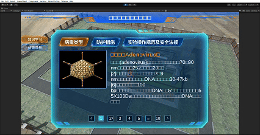
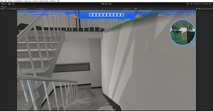
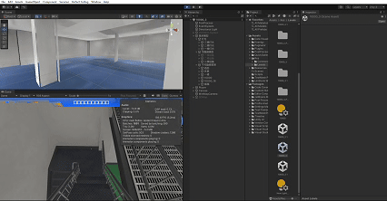

# 三维建筑导航系统项目

## 核心技术

本系统基于分页器、大地图小地图导览和动态模型加载三点技术，实现了一个建筑三维导航项目。

### 1. 分页器控件

- 提供前一页和后一页的翻页操作

- 实时显示当前页面位置和总页数信息

- 根据用户所在区域自动调整页面内容

### 2. 大地图小地图导览

- 实时显示人物当前位置和朝向箭头

- 提供快速楼层切换的界面控制功能

- 支持建筑框架透视，可查看内部并自由调整观察角度。

### 3. 动态模型加载优化

- 不可隐藏框架保持关键结构始终显示

- 将可隐藏模型按区域分为多个批次

- 依据玩家位置动态调度加载批次
